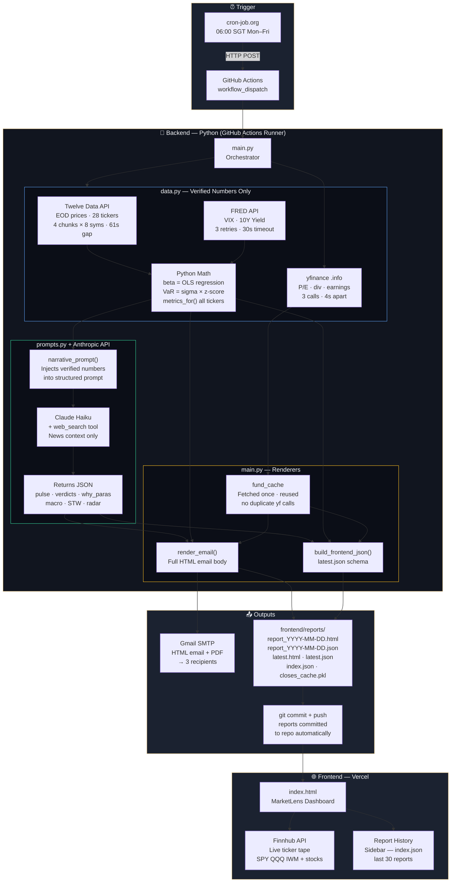

# 📈 MarketLens — Daily Market Intelligence

Daily automated stock market report — verified numbers from real APIs, AI-written narrative, emailed at 07:00 SGT and viewable on a live dashboard.

---

## Architecture Overview


The system has a hard separation between **data** (always deterministic) and **narrative** (AI-generated). The LLM never invents a number — it only writes commentary on top of verified data.

```
cron-job.org (06:00 SGT)
    → GitHub Actions (Ubuntu runner)
        → data.py        fetches prices (Twelve Data + FRED), computes beta/VaR in Python
        → main.py        fetches fundamentals (yfinance, 3 calls only)
        → prompts.py     feeds verified numbers to Claude Haiku + web_search
        → main.py        renders HTML email + frontend JSON
        → Gmail SMTP     sends to 3 recipients
        → git push       commits reports to repo → Vercel auto-updates dashboard
```

---

## Repo Structure

```
market-report/
├── backend/
│   ├── main.py              ← Orchestrator: fetch → narrate → render → email
│   ├── data.py              ← Trust layer: Twelve Data + FRED + beta/VaR math
│   ├── config.py            ← Static config: tickers, email list, model name
│   ├── prompts.py           ← Single LLM prompt: injects real numbers, gets narrative JSON
│   ├── requirements.txt
│   ├── logs/
│   └── closes_cache.pkl     ← Fallback cache if APIs fail (auto-generated, committed)
├── frontend/
│   ├── index.html           ← MarketLens dashboard (deployed to Vercel)
│   └── reports/             ← Auto-committed daily by GitHub Actions
│       ├── latest.html
│       ├── latest.json
│       ├── index.json       ← Report history manifest (last 30)
│       └── report_YYYY-MM-DD.{html,json}
├── .github/
│   └── workflows/
│       └── market_report.yml ← GitHub Actions workflow
└── vercel.json
```

---

## How It Works — File by File

### `config.py`
Static configuration only. No logic. Defines:
- `INDICES` — SPY, QQQ, IWM, ^VIX (ETF proxies — Alpha Vantage doesn't support raw index symbols)
- `WATCHLIST_AI` — 10 AI/Mag7 stocks
- `SPOTLIGHTS` — 3 deep-dive stocks (C, QRVO, MU)
- `SECTOR_ETFS` — 11 SPDR ETFs for sector rotation
- `all_tickers()` — deduped list of every symbol needing price history

### `data.py`
The trust layer. **No LLM touches this file's output.**

| Function | What it does |
|---|---|
| `fetch_closes()` | Fetches 365 days of EOD closes via Twelve Data (chunks of 8, 61s gap) + FRED for VIX/TNX. Falls back to `closes_cache.pkl` on failure. |
| `metrics_for()` | Computes price, day change, 1W/1M/1Y returns, 52W high/low, parametric VaR (95%/99%), historical VaR from a Close series |
| `beta_vs_market()` | **Real beta**: `Cov(r_stock, r_market) / Var(r_market)` via OLS on daily returns — not a ratio of annual moves |
| `fundamentals_for()` | P/E, dividend yield, analyst rating, price target, next earnings via yfinance `.info` (3 calls only, called once in main with 4s gaps) |
| `early_warning()` | Deterministic signal scoring: VIX level, breadth (sectors up), S&P vs 50-day MA, consumer confidence, 10Y yield |
| `build_report_data()` | Assembles the full verified data dict passed to the LLM |

**Data sources:**
- **Twelve Data** — equities, ETFs, indices (800 free credits/day; 28 tickers = 28 credits)
- **FRED** (St. Louis Fed) — VIX (`VIXCLS`) and 10Y Treasury yield (`DGS10`) — free, unlimited
- **yfinance `.info`** — fundamentals only, 3 tickers, called once per run

### `prompts.py`
Builds a single structured prompt that:
1. Injects all verified numbers as JSON the LLM cannot modify
2. Instructs the LLM to use `web_search` only for qualitative news context
3. Requires a strict JSON schema response (no prose, no markdown)

The LLM returns: `pulse`, `spotlights` (rating/verdict/business_risk), `why_paras`, `macro`, `opportunity_radar`, `portfolio_direction`, `stw` (5 stock picks).

### `main.py`
Orchestrates the full pipeline:
1. `get_market_context()` — determines if NYSE is open (via `pandas_market_calendars`)
2. `build_report_data()` — all verified numbers
3. `fund_cache` — fetches fundamentals once with `time.sleep(4)` between calls; passed everywhere (eliminates duplicate yfinance hits)
4. `get_narrative()` — single Claude Haiku call, returns narrative JSON
5. `render_email()` — builds HTML email from numbers + narrative
6. `build_frontend_json()` — builds JSON for the dashboard
7. `save_report()` — writes HTML + JSON to `frontend/reports/`
8. `send_email()` — Gmail SMTP with optional PDF attachment

### `frontend/index.html`
Single-file dashboard. Reads `latest.json` (or any `report_YYYY-MM-DD.json`) from the reports folder. Live ticker tape via **Finnhub API** (independent of the backend — uses ETF proxy symbols SPY/QQQ/IWM to match report data).

---

## Setup

### 1. Credentials

Add these to GitHub repo secrets and your local `.env`:

| Variable | Where to get it |
|---|---|
| `ANTHROPIC_API_KEY` | https://console.anthropic.com |
| `TWELVEDATA_API_KEY` | https://twelvedata.com (free — 800 req/day) |
| `FRED_API_KEY` | https://fred.stlouisfed.org/docs/api/api_key.html (free) |
| `GMAIL_ADDRESS` | Your Gmail address |
| `GMAIL_APP_PASSWORD` | Google Account → Security → App Passwords |

### 2. GitHub Actions Workflow (`.github/workflows/market_report.yml`)

Triggered via `workflow_dispatch` (called by cron-job.org at 06:00 SGT Mon–Fri). Runs on `ubuntu-latest`, installs dependencies, executes `python main.py`, then commits any new reports back to the repo.

### 3. Deploy Dashboard to Vercel

1. Push repo to GitHub
2. Vercel → Add New Project → import repo
3. `vercel.json` routes `/reports/*` to `frontend/reports/`
4. Dashboard live at `https://your-project.vercel.app`

Every time GitHub Actions runs and pushes new report files, Vercel auto-deploys.

### 4. Set up cron-job.org

Create a free job at https://cron-job.org to POST to your GitHub Actions workflow URL at 22:00 UTC (06:00 SGT) Monday–Friday.

---

## Run Locally

```bash
cd backend
pip install -r requirements.txt
cp .env.example .env   # fill in your keys
python main.py --force  # --force bypasses weekend check
```

The fetch takes ~4 minutes on the free Twelve Data tier (4 chunks × 61s). Subsequent runs use the cache.

---

## Adding / Changing Tickers

Edit `config.py` only — everything else reads from it:

```python
# Add to watchlist
WATCHLIST_AI = [
    ...
    {"symbol": "PLTR", "name": "Palantir"},
]

# Change spotlights
SPOTLIGHTS = [
    {"symbol": "NVDA", "name": "Nvidia"},
    {"symbol": "C",    "name": "Citigroup"},
    {"symbol": "MU",   "name": "Micron Technology"},
]
```

Keep total unique tickers (from `all_tickers()`) at or below 25 if on Twelve Data free tier. Check with:
```bash
python -c "from config import all_tickers; from data import FRED_MAP; print(len([t for t in all_tickers() if t not in FRED_MAP]))"
```

---

## Key Design Decisions

| Decision | Reason |
|---|---|
| Twelve Data over yfinance | yfinance rate-limits aggressively on GitHub Actions IP ranges |
| FRED for VIX/TNX | Official Fed data, unlimited, no IP restrictions |
| ETF proxies (SPY/QQQ/IWM) instead of ^GSPC/^NDX | Twelve Data free tier doesn't support raw index symbols |
| Single LLM call | One structured JSON response is more reliable than 3 separate HTML-generating calls |
| `fund_cache` pattern | Prevents 6 duplicate yfinance calls (3 in render, 3 in JSON build) that all hit rate limits |
| Commits cache to repo | GitHub Actions runners are ephemeral — any written file is gone after the job ends unless committed |
| Beta = OLS regression | `Cov(r_s, r_m) / Var(r_m)` is correct. The old approach (`52W% stock / 52W% index`) is wrong and produces nonsense |

---

## Not Financial Advice

Auto-generated. Prices from public APIs. Commentary AI-generated. Do your own research.